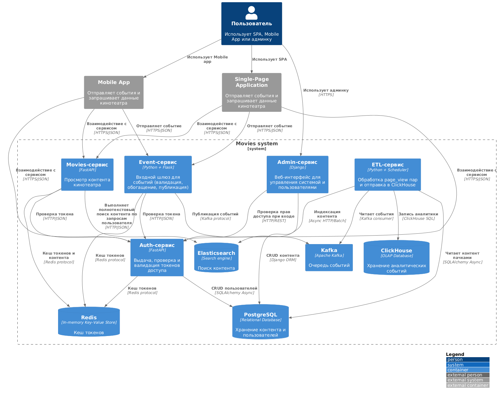
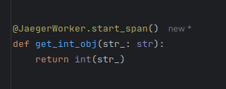
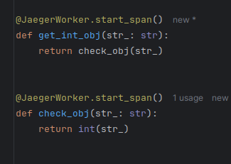
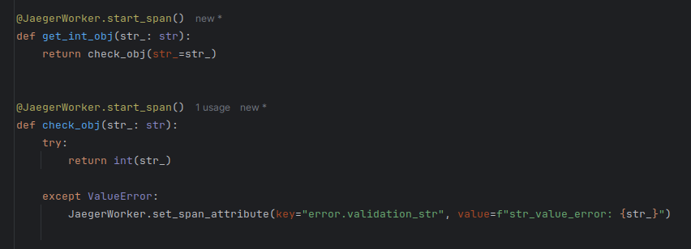
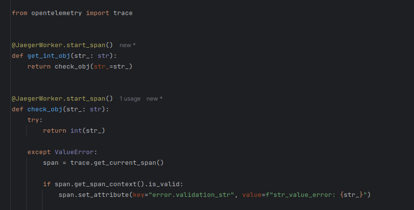

# Проектная работа Кинотеатра

**Цель работы** - реализация микросервисной архитектуры **"Кинотеатр"**.

* * *

🔹 **Запуск проекта (запуск в текущей директории):**
```sh
docker compose up -d
```
🔹 **Запуск проекта с открытыми портами сервисов (запуск в текущей директории):**
```sh
docker compose -f ./docker-compose.yaml -f ./docker-compose.override.yaml up -d
```

* * *

🔹 **Запуск тестов (запуск в директории 'tests'):**
```sh
docker compose -f ./docker-compose-apps.yaml -f ./docker-compose-services.yaml -f ./docker-compose-tests.yaml up -d
```
🔹 **Запуск тестов с открытыми портами сервисов (запуск в директории 'tests'):**
```sh
docker compose -f ./docker-compose-apps.yaml -f ./docker-compose.override.yaml -f ./docker-compose-services.yaml -f ./docker-compose-tests.yaml up -d
```
🔹 **Запуск сервисов с открытыми портами для написания тестов (запуск в директории 'tests'):**
```sh
docker compose -f ./docker-compose-apps.yaml -f ./docker-compose-services.yaml -f ./docker-compose.override.yaml up -d
```

* * *

## Стек технологий
- Python 3.12;
- Контейнеризация:
- - **Docker**(https://docs.docker.com/);
- Web Servers:
- - **Uvicorn**(https://www.uvicorn.org/);
- - **Nginx**(https://nginx.org/en/docs/);
- Rest-Frameworks:
- - **Fast API**(https://fastapi.tiangolo.com/);
- - **Django API**(https://www.djangoproject.com/);
- SearchEngine / DataBase:
- - **Elasticsearch**(https://www.elastic.co/guide/en/elasticsearch/client/python-api/current/index.html);
- - **RedisCluster**(https://redis-py.readthedocs.io/en/stable/index.html);
- - **PostgreSQL**(**SQLAlchemyORM**: https://docs.sqlalchemy.org/en/20/orm/);
- DataModels:
- - **Pydantic**(https://docs.pydantic.dev/latest/);
- Distributed Tracing:
- - **OpenTelemetry**(https://opentelemetry.io/docs/languages/python/);
- - **Jaeger**(https://www.jaegertracing.io/docs/latest/);

## Архитектура проекта
### Основные модули проекта:
- Сервис кинотеатра (сервис выдачи контента);
- ETL-сервис;
- Панель администратора;
- Auth-сервис;
- Сервис распределенной трассировки (Jaeger);
- Тесты;
- Event-сервис ([Выявленные требования](docs/analytics/requirements.md))

Ссылка на схему архитектуры проекта:


## Основные модели Postgres
- FilmWork: Фильм;
- Genre: Жанр;
- GenreFilmWork: связь Жанра с Фильмом;
- Person: Персона;
- PersonFilmWork: связь Персоны с Фильмом;
- User: Пользователь;
- LoginHistory: история авторизации пользователя;

Ссылка на схему БД:
- https://drive.google.com/file/d/1uhfVmdkwkYb973xCO4KKJH7z-H4QNRQM/view?usp=sharing

## Схемы индексов Elasticsearch
- TODO: добавить

## Работа с Jaeger(OpenTelemetry):
### Сервисы, использующие распределённую трассировку:
- **movies_service**;
- **auth_service**;

### Методы работы с Jaeger (JaegerWorker):
Если в рамках текущего **trace** нужно добавить новый **span**, требуется установить декоратор
на требуемый метод/функцию (example_1):




Если в рамках текущего **trace** нужно добавить наследуемую цепочку **span**, требуется установить декораторы
на методы/функции в соответствующем порядке (example_2):




Если в рамках текущего **trace** нужно добавить новый **span**, и в нем указать атрибут, требуется установить декоратор
на метод/функцию и указать в нужном месте добавление атрибута (example_3):




Если в рамках текущего **trace** нужно добавить новый **span** в обход обработчика **JaegerWorker** (example_4):



* * *

# Соглашения разработки:
## GitFlow
### Ветки (branches):
- **main**: основная(работоспособная) ветка кода, содержащая код для отправки на ревью.
- **develop**: рабочая ветка, содержащая актуальную кодовую базу для разработки.

### Работа с ветками:
- Разработка нового функционала: branch: develop -> feature/....
- Исправление ошибки в новом функционале: branch: develop(main) -> fix/...

## REST-URI:
### Версионирование:
- Поддержка **Stripe**-подхода (https://docs.stripe.com/api/versioning)

### Шаблоны построения URI-методов:
Ссылка на источник: https://www.vinaysahni.com/best-practices-for-a-pragmatic-restful-api#restful
#### GET:
- **v1/film_works**: получение массива сущностей **FilmWork**;
- **v1/film_works?title=SomeTitle**: фильтрация массива сущностей **FilmWork** по полю **title**;
- **v1/film_works?sort=-title**: сортировка массива сущностей **FilmWork** по полю **title**(desc);
- **v1/film_works?q=SomeTitle**: поиск массива сущностей **FilmWork** по полю **title** с использованием SearchEngine;
- **v1/film_works/{id}**: получение сущности **FilmWork** по **ID**;

#### GET(пример):
- **v1/film_works?description=SomeDescription&title=SomeTitle&sort=-rating**: поиск массива сущностей **FilmWork**,
имеющие в поле **description** значение "SomeDescription", фильтрация по полю **title** равное "SomeTitle",
отсортированное по полю **rating**(desc);

#### POST:
- TODO: добавить

#### POST(пример):
- TODO: добавить

## Code Style:
- **PEP8**(https://peps.python.org/pep-0008/), необходимо соблюдать;
- Docstring-формат - **Epytext**(https://epydoc.sourceforge.net/manual-epytext.html), желательно соблюдать;
- Linters: **Flake8**(https://flake8.pycqa.org/en/latest/) или любой другой не конфликтующий, желательно соблюдать;
- **Pre-commit**(https://pre-commit.com/), желательно использовать;
