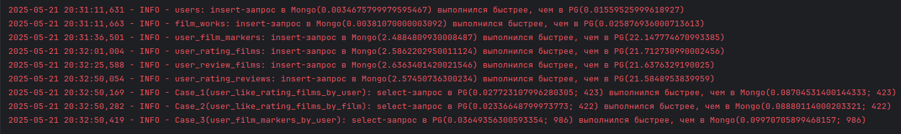
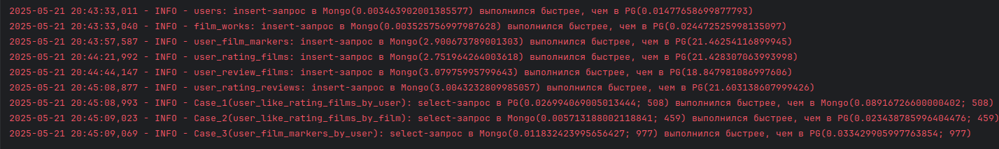
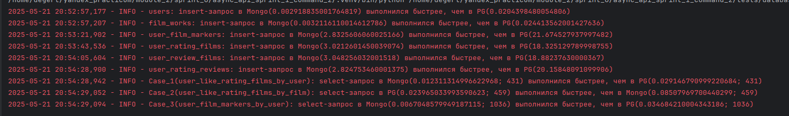
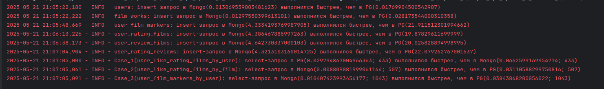
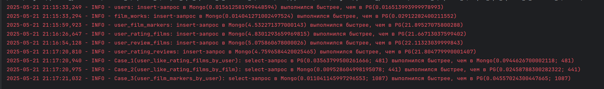
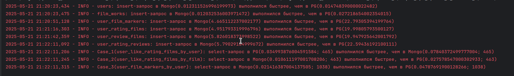

# Сравнение Mongo и Postgres

**Цель работы** - сравнение производительности Mongo и Postgres в разных условиях.

## Предварительные условия:
- создать файл **'tests/database_comparison/.env'** и перенести туда данные из файла **'tests/database_comparison/.env_example'**
- установить зависимости:
```sh
pip install -r ./requirements.txt
```
- Поднять Postgres и Mongo(без шардирования) **ИЛИ(!)** поднять Postgres и Mongo(c шардированием):

**Запуск Postgres и Mongo(без шардирования):**
```sh
docker compose -f ./docker-compose-mongo-without-shard.yaml up -d
```

**Запуск Postgres и Mongo(c шардированием):**
```sh
docker compose -f ./docker-compose-mongo-with-shard.yaml up -d
```
- Инициализация config-серверов:
```sh
docker exec -it mongocfg1 mongosh --eval '
rs.initiate({
    _id: "mongors1conf",
    configsvr: true,
    members: [
        {_id: 0, host: "mongocfg1:27017"},
        {_id: 1, host: "mongocfg2:27017"},
        {_id: 2, host: "mongocfg3:27017"}
    ]
})'
```
- Инициализация шардов:
- - Для первого шарда:
```sh
docker exec -it mongors1n1 mongosh --eval '
rs.initiate({
    _id: "mongors1",
    members: [
        {_id: 0, host: "mongors1n1:27017"},
        {_id: 1, host: "mongors1n2:27017"},
        {_id: 2, host: "mongors1n3:27017"}
    ]
})'
```
- - Для второго шарда:
```sh
docker exec -it mongors2n1 mongosh --eval '
rs.initiate({
    _id: "mongors2",
    members: [
        {_id: 0, host: "mongors2n1:27017"},
        {_id: 1, host: "mongors2n2:27017"},
        {_id: 2, host: "mongors2n3:27017"}
    ]
})'
```
- Добавление шардов через Mongos:
```sh
docker exec -it mongos1 mongosh --eval '
sh.addShard("mongors1/mongors1n1:27017,mongors1n2:27017,mongors1n3:27017");
sh.addShard("mongors2/mongors2n1:27017,mongors2n2:27017,mongors2n3:27017")'
```

**Запуск тестов:**
- После повторений условий, описанных в каждом test-case, требуется запустить тесты:
```sh
python ./run.py
```

**Рассматриваемые test-case:**
- Выборка списка понравившихся пользователю фильмов**;
- Выборка количества лайков у определённого фильма**;
- Выборка списка закладок.

** Лайк - выставленный рейтинг выше 7-ми.

* * *

## Тест Postgres и Mongo(без шардирования):
**Case №1**:

Условия тестирования (воспроизведения):
- Mongo без шардирования, без индексов.
- .env-файл:
```sh
MONGO_WITH_SHARD=0
MONGO_WITH_INDEX=0
COUNT_ENTITIES=250000
...
```

**Результат Case №1:**

- insert-запросы в Mongo выполнены быстрее.
- select-запрос в Postgres выполнены быстрее.


**Case №2**:

Условия тестирования (воспроизведения):
- Mongo без шардирования, с индексами.
- .env-файл:
```sh
MONGO_WITH_SHARD=0
MONGO_WITH_INDEX=1
COUNT_ENTITIES=250000
...
```

**Результат Case №2:**

- insert-запросы в Mongo выполнены быстрее.
- select-запрос в Mongo выполнены быстрее (2 из 3).
- select-запрос в Mongo для **user_rating_films** с индексом **film_id**(дефолтный) выполнился быстрее в месте 
использования: **Case_2(user_like_rating_films_by_film)**.


**Case №3**:

Условия тестирования (воспроизведения):
- Mongo без шардирования, с индексами.
- Изменим индекс для **user_rating_films** (Оценка фильмов пользователями) с **film_id**(дефолтный) на **user_id**
- .env-файл:
```sh
MONGO_WITH_SHARD=0
MONGO_WITH_INDEX=1
COUNT_ENTITIES=250000

USER_RATING_REVIEWS_INDEX_KEY=user_id
...
```

**Результат Case №3:**

- insert-запросы в Mongo выполнены быстрее.
- select-запрос в Mongo выполнены быстрее (2 из 3).
- select-запрос в Mongo для **user_rating_films** с индексом **user_id** выполнился быстрее в месте 
использования (т.к. индекс был изменен с **film_id**(дефолтный) на **user_id**, см. Case №2): **Case_1(user_like_rating_films_by_user)**.


## Тест Postgres и Mongo(c шардированием):
**Case №4**:
Условия тестирования (воспроизведения):
- Mongo c шардированием, без индексов.
- .env-файл:
```sh
MONGO_WITH_SHARD=1
MONGO_WITH_INDEX=0
COUNT_ENTITIES=250000
...
```

**Результат Case №4:**

- insert-запросы в Mongo выполнены быстрее.
- select-запрос в Mongo выполнены быстрее (2 из 3).
- select-запрос в Mongo для **user_rating_films** с ключем-шардирования **film_id**(дефолтный) выполнился быстрее в месте 
использования: **Case_2(user_like_rating_films_by_film)**.


**Case №5**:
Условия тестирования (воспроизведения):
- Mongo c шардированием, без индексов.
- Изменим ключ-шардирования для **user_rating_films** (Оценка фильмов пользователями) с **user_id**(дефолтный) на **film_id**
- .env-файл:
```sh
MONGO_WITH_SHARD=1
MONGO_WITH_INDEX=0
COUNT_ENTITIES=250000

USER_RATING_REVIEWS_SHARD_KEY=film_id
...
```

**Результат Case №5:**

- insert-запросы в Mongo выполнены быстрее.
- select-запрос в Mongo выполнены быстрее (2 из 3).
- select-запрос в Mongo для **user_rating_films** с ключем-шардирования **user_id** выполнился быстрее в месте 
использования, но не быстрее чем в Postgres (т.к. ключем-шардирования был изменен с **film_id**(дефолтный) на **user_id**, см. Case №2): **Case_1(user_like_rating_films_by_user)**.


**Case №6**:
Условия тестирования (воспроизведения):
- Mongo c шардированием, c индексами.
- .env-файл:
```sh
MONGO_WITH_SHARD=1
MONGO_WITH_INDEX=1
COUNT_ENTITIES=250000
...
```

**Результат Case №6:**

- insert-запросы в Mongo выполнены быстрее.
- select-запрос в Mongo выполнены быстрее (2 из 3).
- select-запрос в Mongo для **user_rating_films** с ключем-шардирования **film_id**(дефолтный) выполнился быстрее в месте 
использования: **Case_2(user_like_rating_films_by_film)**.